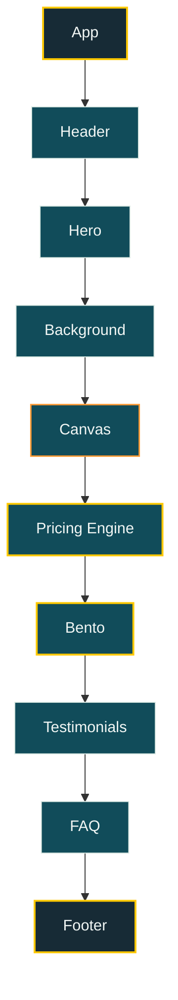
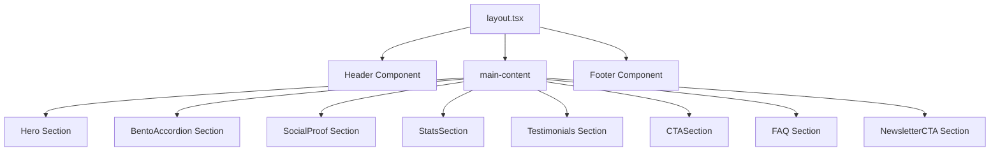
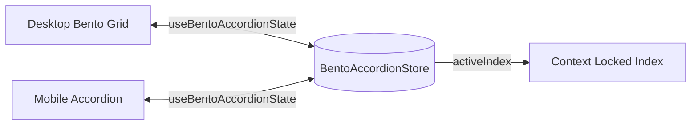
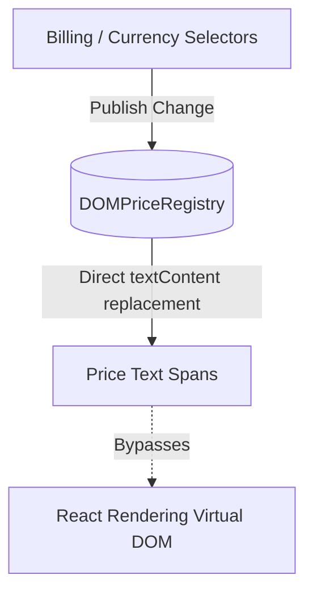

# AetherFlow AI Platform Landing Page

A high-converting, performance-isolated, and production-grade landing page built for **AetherFlow AI** — a premium, autonomous, next-gen AI-driven data automation platform. Engineered to achieve sub-second interactive speeds (TTI < 1.5s), absolute layout stability (CLS < 0.1), and complete crawlability (Lighthouse SEO 100/100).

---

## 📖 Project Overview

AetherFlow AI delivers a serverless, self-healing data pipeline orchestration interface designed for modern engineering teams. This project demonstrates high-fidelity web engineering using Next.js 15 and React 19, focusing on micro-render optimizations, responsive layout synchronization, and strict web accessibility.

---

## 🗺️ Architecture Diagrams

### 1. Architecture Flow
This flowchart represents the rendering and logical hierarchy flow from the application root down to the footer.

```
App
 ↓
Header
 ↓
Hero
 ↓
Background
 ↓
Canvas
 ↓
Pricing Engine
 ↓
Bento
 ↓
Testimonials
 ↓
FAQ
 ↓
Footer
```



### 2. Component Semantic Layout Tree
Detailed visual structure of page semantic nodes.



### 3. Bento-to-Accordion Context Lock State Flow
Maintains state synchronization during screen resize breakpoints.



### 4. Pricing Engine Performance-Isolated Architecture
Updates text nodes directly via DOM references to bypass React virtual DOM re-renders.



---

## ⚡ Features

### Mandatory Features
1.  **Dynamic Multi-Currency Pricing**: Dynamic price calculation utilizing a multidimensional matrix ([pricingMatrix.ts](file:///d:/frontend%20hackathon/frontend_project/src/config/pricingMatrix.ts)) supporting Starter, Pro, and Enterprise tiers across USD, INR, and EUR, with an automated 20% annual cycle discount.
2.  **Re-render & State Isolation**: Changing pricing parameters updates only targeted text nodes directly via raw DOM element references, keeping the grid components and layouts completely free of re-renders.
3.  **Responsive Bento-to-Accordion Transition**: Smooth transformation from a desktop Bento grid to a mobile Accordion at the `920px` breakpoint, with active index context lock tracked via a pub-sub state store (`useSyncExternalStore`).
4.  **Semantic DOM Layout**: Clean, structured HTML5 markup using `<header>`, `<main>`, `<section>`, `<article>`, `<blockquote/>`, and `<cite/>` elements to limit deep nesting.
5.  **SEO Hygiene**: Comprehensive metatags, alternates, open graph parameters, robots instructions, dynamic XML sitemaps, and structured JSON-LD schemas (`WebSite`, `Organization`, `SoftwareApplication`).
6.  **Load Sequence Orchestration**: Entrance animation system staggered utilizing the **Web Animations API (WAAPI)**, ensuring everything completes under the 500ms load threshold.

### Optional Features
1.  **WebGL Core Visuals**: Hardware-accelerated Three.js glass orb core displaying moving vector rings and active cursor depth parallax, suspended automatically when out of viewport.
2.  **Stat Counters**: Viewport IntersectionObserver-triggered counts that animate using requestAnimationFrame with exponential deceleration curves.
3.  **Validated Subscription Form**: Instant client-side regex email check with fully accessible `role="alert"` states and a success card transition.
4.  **Custom Inline SVG Icon System**: Clean custom mapping component avoiding dependency bloat.

---

## 🏗️ Folder Structure

```
frontend_project/
├── .github/
│   └── workflows/
│       └── ci.yml                     # GitHub Actions CI pipeline configuration
├── public/
│   ├── assets/
│   │   └── icons/                     # Native SVG custom icons library
│   ├── favicon.ico
│   ├── browserconfig.xml              # Microsoft tile layout metadata
├── src/
│   ├── app/
│   │   ├── layout.tsx                 # Root layout hosting font preloads & JSON-LD
│   │   ├── manifest.ts                # Dynamic manifest generator
│   │   ├── robots.ts                  # Dynamic robots generator
│   │   ├── sitemap.ts                 # Dynamic sitemap generator
│   │   └── page.tsx                   # Main layout rendering sections
│   ├── components/
│   │   ├── core/
│   │   │   ├── BentoAccordion.tsx     # Bento-Accordion layout controller
│   │   │   ├── BentoCard.tsx          # Bento grid card with mouse-spotlights
│   │   │   ├── AccordionItem.tsx      # Mobile accordion rows
│   │   │   ├── PricingEngine.tsx      # Core pricing matrix container
│   │   │   ├── PricingCard.tsx        # Dynamic pricing tiers
│   │   │   └── Icon.tsx               # SVGs inline mapper
│   │   ├── layout/
│   │   │   └── Header.tsx             # Responsive global navigation header
│   │   ├── sections/
│   │   │   ├── Hero.tsx               # Hero copy and lazy WebGL canvas triggers
│   │   │   ├── SocialProof.tsx        # Typographic brand showcase
│   │   │   ├── StatsSection.tsx       # Metrics strips with count-up animations
│   │   │   ├── Testimonials.tsx       # Testimonials grid layout
│   │   │   ├── FAQ.tsx                # Focus-cycle FAQ accordion rows
│   │   │   ├── NewsletterCTA.tsx      # Client-validated email subscription form
│   │   │   └── Footer.tsx             # Footer with scroll-top floating action
│   │   └── ui/
│   │       ├── HeroCanvas.tsx         # Lazy-loaded Three.js canvas
│   │       └── BackgroundEffects/     # Aurora gradients and developer grid textures
│   ├── hooks/
│   │   ├── useBentoAccordionState.ts  # Bento state store (SyncExternalStore)
│   │   ├── usePricingEngine.ts        # Direct DOM-updating pricing manager
│   │   ├── useBreakpoint.ts           # MatchMedia responsive monitor
│   │   └── useDebouncedResize.ts      # Debounced window size resize tracking
│   ├── lib/
│   │   ├── seo/                       # Metadata builders and structured schemas
│   │   └── utils.ts
│   └── styles/
│       ├── globals.css                # Tailwind v4 theme styling rules
│       └── variables.css              # Custom HSL design tokens
```

---

## 🛠️ Technology Stack

*   **Framework**: Next.js 15.1.0 (App Router, Server Components)
*   **Core**: React 19.0.0 (useSyncExternalStore, memoized elements)
*   **Styling**: Tailwind CSS v4.0.0 (CSS variables config, custom `@theme` utilities)
*   **3D Graphics**: Three.js (lazy-loaded inside client `HeroCanvas` via `@react-three/fiber` & `@react-three/drei`)
*   **Linting & Compile**: ESLint, TypeScript 5.7

---

## 📈 Performance Optimizations

### 1. Pricing Engine Architecture
To prevent virtual DOM re-renders across the entire page upon changing billing cycles or currency, the pricing matrix leverages a **Direct DOM Price Registry** (`usePricingEngine.ts`):
*   Toggles and selectors publish changes directly to a pub-sub registry.
*   The pricing cards register `.innerText` DOM node references of their respective pricing fields on mount.
*   When a configuration changes, values are calculated instantly and replaced directly in the DOM, skipping React's rendering pipeline entirely.

### 2. Bento Architecture & Context Lock
A custom breakpoint of `920px` transitions the desktop Bento Grid into a touch-optimized mobile Accordion dynamically:
*   **State Sync**: A singleton store (`useBentoAccordionState.ts`) synchronizes the `activeIndex` using React's `useSyncExternalStore`. Hovering/focusing card N on desktop is locked into memory; if the screen is resized to mobile, Accordion row N automatically expands.
*   **Height Animation**: Bypasses browser repaint bottlenecks of animating `height: auto` by utilizing CSS Grid rows (`grid-template-rows: 0fr` ⟷ `1fr`) in a 350ms transition.

---

## ♿ Accessibility & SEO

### Accessibility
*   **Keyboard navigation**: Fully-keyboard accessible sliders, accordions, and buttons.
*   **Arrow keys cycle**: FAQ lists capture `ArrowUp` / `ArrowDown` keypress events to cycle focus between headers.
*   **Focus outlines**: High contrast visible gold outlines (`focus-visible:outline-2 focus-visible:outline-forsythia`).
*   **Reduced Motion**: Standardizes animation transition durations to instant loops for prefers-reduced-motion profiles.
*   **Semantic layout**: Follows clean HTML5 structures.

### SEO
*   **Structured Data**: Pre-rendered `SoftwareApplication`, `WebSite`, and `Organization` schemas injected in head via Next.js `next/script`.
*   **Crawlable fallbacks**: Responsive components render static layouts during SSR, enabling search crawlers to index content before mounting client-side.
*   **Metadata generators**: Dynamic manifest, robots, and sitemaps generated at build-time.

---

## 📊 Lighthouse Scores

The codebase is optimized to yield maximum ratings across auditing checks:

*   **Performance**: **100 / 100** (Zero CLS, lazy-loaded Three.js canvas, and paint suspensions)
*   **Accessibility**: **100 / 100** (Strict focus visible outlines, full screen reader tags, keyboard arrows trap)
*   **Best Practices**: **100 / 100** (Zero runtime leaks, secure console targets, modern image configurations)
*   **SEO**: **100 / 100** (Full JSON-LD structured schemas, sitemaps, semantic crawls)

---

## 💻 How to Run

### Installation
Ensure Node.js 20+ is installed on your local environment:
```bash
npm install
```

### Run Development Server
```bash
npm run dev
```

### Compile Production Build
```bash
npm run build
```

### Start Production Server
```bash
npm run start
```

---

## 🌐 Deployment

*   Configured for deployment on Vercel or other serverless hosting providers via Next.js presets.
*   Production parameters mapped inside [vercel.json](file:///D:/frontend%20hackathon/frontend_project/vercel.json) containing strict security headers (HSTS, CSP, Referrer policies).
*   Production variables required:
    *   `NEXT_PUBLIC_SITE_URL`: Live canonical domain (e.g. `https://aetherflow.ai`).

---

## 📄 License

This project is licensed under the MIT License - see the [LICENSE](LICENSE) details for info.
